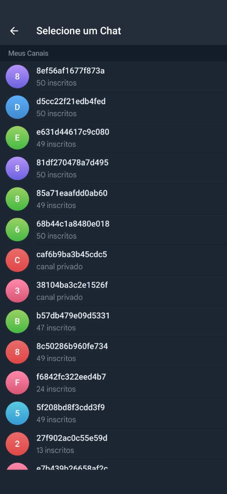
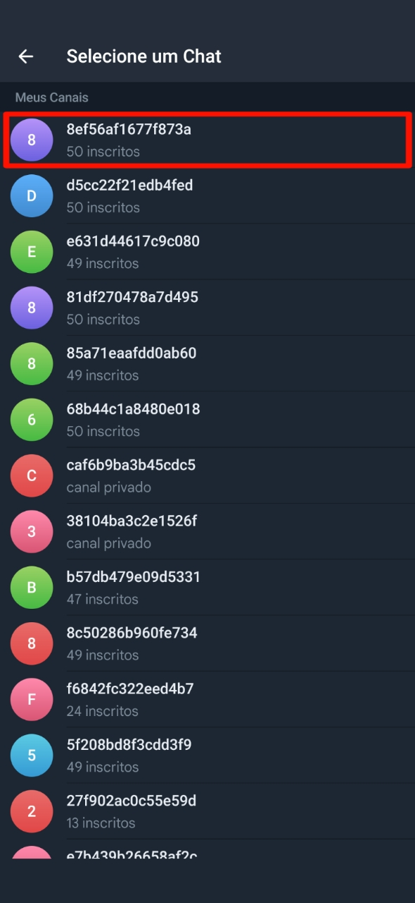
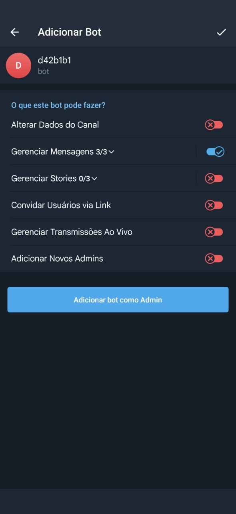
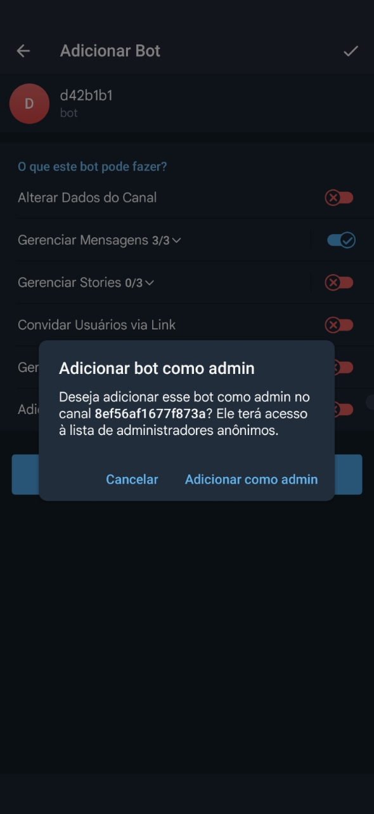
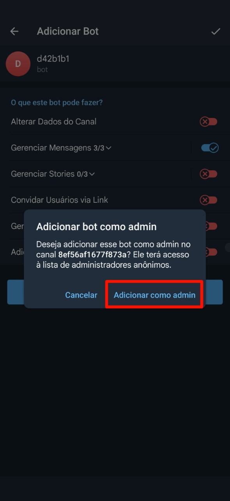

# Adicionado os robôs

Após criar os canais, o próximo passo é adicionar nossos robôs como administradores em cada um deles. Para isso, clique nos links abaixo.

Ao clicar em cada link, seu aplicativo Telegram será aberto e você poderá selecionar o canal para adicionar o robô como administrador.

São aproximadamente 50 robôs no total, e é fundamental que cada um deles seja adicionado a todos os canais que você criou.

- [Adicionar Robô 1](http://t.me/d42b1b1_bot?startchannel=new&admin=post_messages+delete_messages+edit_messages)
- [Adicionar Robô 2](http://t.me/e606866_bot?startchannel=new&admin=post_messages+delete_messages+edit_messages)
- [Adicionar Robô 3](http://t.me/fa31d48_bot?startchannel=new&admin=post_messages+delete_messages+edit_messages)
- [Adicionar Robô 4](http://t.me/c610dee_bot?startchannel=new&admin=post_messages+delete_messages+edit_messages)
- [Adicionar Robô 5](http://t.me/plmcdv_bot?startchannel=new&admin=post_messages+delete_messages+edit_messages)
- [Adicionar Robô 6](http://t.me/TachiyomiExtensionsLogsBot?startchannel=new&admin=post_messages+delete_messages+edit_messages)
- [Adicionar Robô 7](http://t.me/b22d444_bot?startchannel=new&admin=post_messages+delete_messages+edit_messages)
- [Adicionar Robô 8](http://t.me/e8741ad_bot?startchannel=new&admin=post_messages+delete_messages+edit_messages)
- [Adicionar Robô 9](http://t.me/b6bfb36_bot?startchannel=new&admin=post_messages+delete_messages+edit_messages)
- [Adicionar Robô 10](http://t.me/f8ead64_bot?startchannel=new&admin=post_messages+delete_messages+edit_messages)
- [Adicionar Robô 11](http://t.me/d67d1ea_bot?startchannel=new&admin=post_messages+delete_messages+edit_messages)
- [Adicionar Robô 12](http://t.me/e8fc363_bot?startchannel=new&admin=post_messages+delete_messages+edit_messages)
- [Adicionar Robô 13](http://t.me/f1f6ef0_bot?startchannel=new&admin=post_messages+delete_messages+edit_messages)
- [Adicionar Robô 14](http://t.me/d2d4d3a_bot?startchannel=new&admin=post_messages+delete_messages+edit_messages)
- [Adicionar Robô 15](http://t.me/eecc4f0_bot?startchannel=new&admin=post_messages+delete_messages+edit_messages)
- [Adicionar Robô 16](http://t.me/e28f026_bot?startchannel=new&admin=post_messages+delete_messages+edit_messages)
- [Adicionar Robô 17](http://t.me/db5ac5f_bot?startchannel=new&admin=post_messages+delete_messages+edit_messages)
- [Adicionar Robô 18](http://t.me/d4e39e5_bot?startchannel=new&admin=post_messages+delete_messages+edit_messages)
- [Adicionar Robô 19](http://t.me/TtttVvhsjvBot?startchannel=new&admin=post_messages+delete_messages+edit_messages)
- [Adicionar Robô 20](http://t.me/e17113a_bot?startchannel=new&admin=post_messages+delete_messages+edit_messages)
- [Adicionar Robô 21](http://t.me/e496411_bot?startchannel=new&admin=post_messages+delete_messages+edit_messages)
- [Adicionar Robô 22](http://t.me/d1baa0c_bot?startchannel=new&admin=post_messages+delete_messages+edit_messages)
- [Adicionar Robô 23](http://t.me/d446f1a_bot?startchannel=new&admin=post_messages+delete_messages+edit_messages)
- [Adicionar Robô 24](http://t.me/e0449d5_bot?startchannel=new&admin=post_messages+delete_messages+edit_messages)
- [Adicionar Robô 25](http://t.me/a15e495_bot?startchannel=new&admin=post_messages+delete_messages+edit_messages)
- [Adicionar Robô 26](http://t.me/e968d8f_bot?startchannel=new&admin=post_messages+delete_messages+edit_messages)
- [Adicionar Robô 27](http://t.me/a382614_bot?startchannel=new&admin=post_messages+delete_messages+edit_messages)
- [Adicionar Robô 28](http://t.me/ac335a0_bot?startchannel=new&admin=post_messages+delete_messages+edit_messages)
- [Adicionar Robô 29](http://t.me/bc9b78d_bot?startchannel=new&admin=post_messages+delete_messages+edit_messages)
- [Adicionar Robô 30](http://t.me/ee08ae5_bot?startchannel=new&admin=post_messages+delete_messages+edit_messages)
- [Adicionar Robô 31](http://t.me/de31cf6_bot?startchannel=new&admin=post_messages+delete_messages+edit_messages)
- [Adicionar Robô 32](http://t.me/c3545fd_bot?startchannel=new&admin=post_messages+delete_messages+edit_messages)
- [Adicionar Robô 33](http://t.me/a24629d_bot?startchannel=new&admin=post_messages+delete_messages+edit_messages)
- [Adicionar Robô 34](http://t.me/b7bbee1_bot?startchannel=new&admin=post_messages+delete_messages+edit_messages)
- [Adicionar Robô 35](http://t.me/a15fbde_bot?startchannel=new&admin=post_messages+delete_messages+edit_messages)
- [Adicionar Robô 36](http://t.me/c484a81_bot?startchannel=new&admin=post_messages+delete_messages+edit_messages)
- [Adicionar Robô 37](http://t.me/e94bcff_bot?startchannel=new&admin=post_messages+delete_messages+edit_messages)
- [Adicionar Robô 38](http://t.me/c85f6b8_bot?startchannel=new&admin=post_messages+delete_messages+edit_messages)
- [Adicionar Robô 39](http://t.me/a44dd45_bot?startchannel=new&admin=post_messages+delete_messages+edit_messages)
- [Adicionar Robô 40](http://t.me/b5397b7_bot?startchannel=new&admin=post_messages+delete_messages+edit_messages)
- [Adicionar Robô 41](http://t.me/ffe2bf3_bot?startchannel=new&admin=post_messages+delete_messages+edit_messages)
- [Adicionar Robô 42](http://t.me/b7b4e0d_bot?startchannel=new&admin=post_messages+delete_messages+edit_messages)
- [Adicionar Robô 43](http://t.me/e3e46f7_bot?startchannel=new&admin=post_messages+delete_messages+edit_messages)
- [Adicionar Robô 44](http://t.me/c510dd1_bot?startchannel=new&admin=post_messages+delete_messages+edit_messages)
- [Adicionar Robô 45](http://t.me/a6c221c_bot?startchannel=new&admin=post_messages+delete_messages+edit_messages)
- [Adicionar Robô 46](http://t.me/eb45802_bot?startchannel=new&admin=post_messages+delete_messages+edit_messages)
- [Adicionar Robô 47](http://t.me/ea1dad0_bot?startchannel=new&admin=post_messages+delete_messages+edit_messages)
- [Adicionar Robô 48](http://t.me/a5c50c8_bot?startchannel=new&admin=post_messages+delete_messages+edit_messages)
- [Adicionar Robô 49](http://t.me/ba47159_bot?startchannel=new&admin=post_messages+delete_messages+edit_messages)

## Passo-a-passo

### Etapa 1

Ao clicar em um dos links, seu Telegram mostrará uma lista com todos os canais nos quais você é administrador. 

### Etapa 2

Clique no canal que você criou.

### Etapa 3

Após selecionar o canal, você verá este menu com várias opções.

### Etapa 4

Deixe todas as opções como estão e clique no botão "**Adicionar bot como Admin**".

### Etapa 5

Surgirá essa pop-up perguntando se você confirma a ação.

### Etapa 6

Confirme a ação clicando em "**Adicionar como Admin**".

### Conclusão

Após o isso, o bot terá sido adicionado no canal como administrador.

Repita este processo quantas vezes forem necessárias até que todos os 50 robôs tenham sido adicionados em todos os canais que você criou.