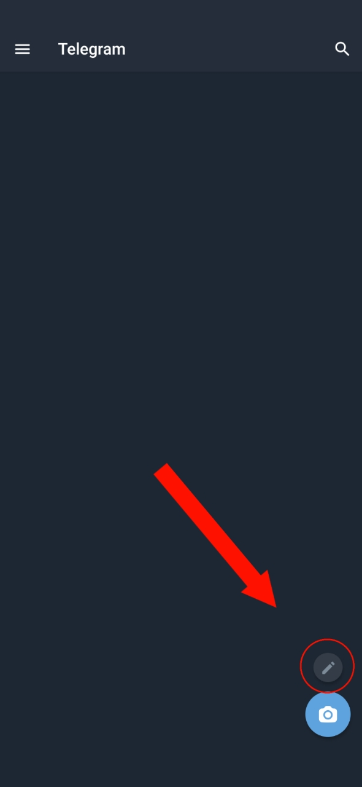
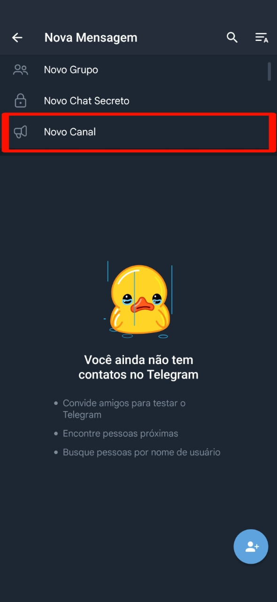
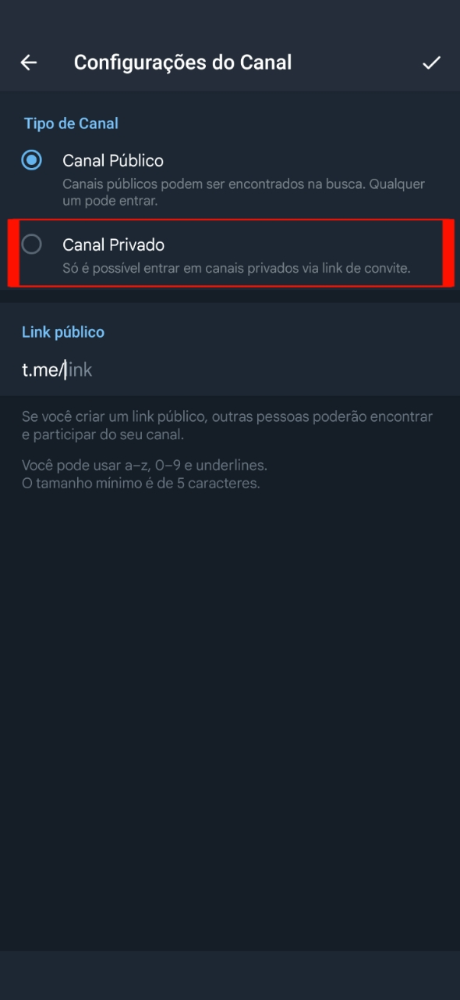
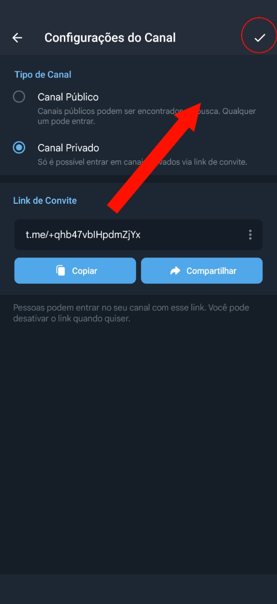
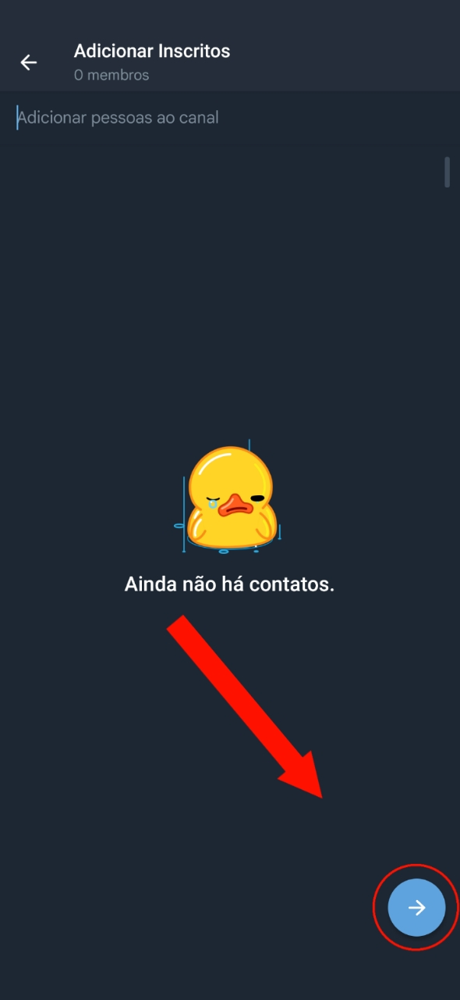

## 1º Passo

Abra o seu Telegram e clique no ícone de lápis que fica no canto inferior direito da tela.

## 2º passo

### Etapa 1

Em seguida, será mostrada esta tela com 3 opções disponíveis para escolha.

### Etapa 2

Clique na última delas, onde está escrito "**Novo Canal**".

## 3º Passo

### Etapa 1

A seguir, será mostrada uma tela solicitando que você escolha um nome para o canal.

### Etapa 2

Clique no campo que diz "**Nome do canal**" e digite um nome qualquer de sua preferência.

### Etapa 3

Um exemplo de nome que pode ser utilizado é simplesmente "Meu canal".

### Etapa 4

Após terminar de digitar, clique no botão que fica no canto superior direito da tela para prosseguir.

## 4° Passo

### Etapa 1

Logo depois, será exibida uma tela de configurações com duas opções disponíveis para escolha.

### Etapa 2

Clique na última opção que diz "**Canal Privado**".

### Etapa 3

### Etapa 4

E, novamente, clique no botão que fica no canto superior direito da tela para continuar.

## 5º Passo

### Etapa 1

Em seguida, você verá esta tela.

### Etapa 2

Você não precisa selecionar nada. Apenas clique no botão azul que fica na parte inferior direita da tela para seguir em frente.

## Conclusão

Pronto! Seu canal foi criado!

